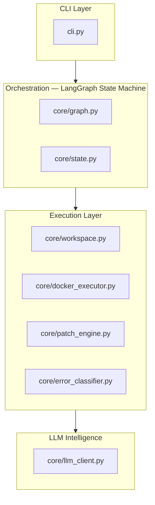
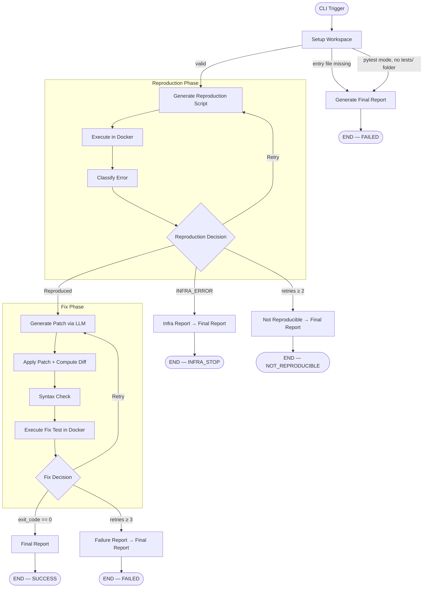
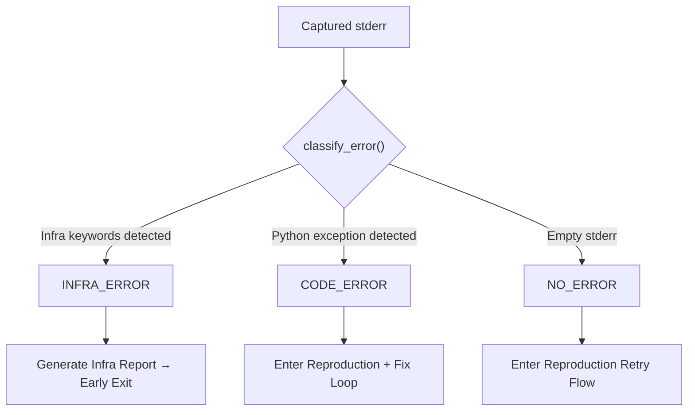

# OpsGuard

**A zero-trust AI remediation engine that refuses to ship a fix it cannot prove.**

OpsGuard follows a strict scientific-method loop — reproduce the bug in an isolated Docker sandbox, propose a fix via LLM, verify the fix passes in the same sandbox, then generate proof artifacts. If a fix cannot be proven, OpsGuard refuses to proceed. No exceptions.

---

## Why OpsGuard?

Current tooling is fragmented:

- Monitoring tools **detect** failures.
- AI tools **generate** patches.
- But there is **no safe bridge** between detection and verified remediation.

Raw LLM patches can hallucinate imports, break dependencies, or silently introduce regressions. OpsGuard closes this trust gap with **deterministic enforcement** — the LLM proposes, Docker verifies, the orchestrator enforces control flow.

---

## High-Level Architecture



**Hard constraints:**

- LLM **never** executes code directly.
- LLM **never** controls workflow state.
- LLM **only** returns text — all output is validated through `validate_llm_patch()` before touching the file system.

---

## Runtime Execution Flow



### Retry Limits

| Phase | Max Retries | On Exhaustion |
|:---|:---:|:---|
| Reproduction | 2 | Marks `NOT_REPRODUCIBLE` |
| Fix | 3 | Marks `FAILED` |

---

## Verification Gates

OpsGuard enforces **five layered safety gates** before accepting any fix:

| Gate | What it checks |
|:---|:---|
| **1 — Entry File Validation** | Verifies entry file exists before any Docker work begins |
| **2 — Tests Folder Check** | In pytest mode, confirms `tests/` folder exists in workspace |
| **3 — LLM Output Validation** | `ast.parse()` + format guard on every LLM response |
| **4 — Syntax Compilation** | `py_compile` on the patched file before Docker execution |
| **5 — Docker Runtime** | Full execution — `exit_code == 0` required to accept the fix |

In `--mode pytest`, Gate 5 runs the full test suite instead of the entry file. The LLM must produce a fix that passes every test.

---

## Error Classification Gate

Before remediation, OpsGuard classifies the failure to determine the workflow path.



**Infra keywords** (early exit — no LLM patch attempted): `401`, `403`, `unauthorized`, `forbidden`, `rate limit`, `timeout`, `connection refused`, `ssl error`, `credential`, `access denied`

**Code errors** (proceed to fix): `ValueError`, `KeyError`, `TypeError`, `AttributeError`, `IndexError`, and general Python exceptions.

---

## Docker Sandbox Strategy

Docker is the **trust boundary**. No LLM output is accepted without Docker confirmation.

| Aspect | Detail |
|:---|:---|
| **Base image** | `python:3.11-slim` |
| **Isolation** | Each run mounts an isolated workspace copy (`-v`) |
| **Capture** | `exit_code`, `stdout`, `stderr` |
| **Cleanup** | Container auto-destroyed after run (`--rm`) |
| **Pytest mode** | Installs `pytest` inside container, runs full test suite |
| **Trust rule** | No fix is accepted unless Docker confirms `exit_code == 0` |

---

## Patch Strategy

OpsGuard does **not** trust LLM-generated line numbers or fragile diff positions.

1. LLM returns the **full updated file content**.
2. `patch_engine.py` computes a **unified diff** via `difflib`.
3. Engine writes the patched file to the isolated workspace.
4. Docker **re-executes and confirms** the fix.

This makes patches fully auditable and position-assumption-free.

---

## LLM Providers

| Provider | Role |
|:---|:---|
| **NVIDIA NIM** | Primary — `meta/llama-3.1-70b-instruct` |
| **Groq** | Fallback — `llama-3.3-70b-versatile` |

Each LLM call uses a strict validator:

- Rejects markdown fences and explanatory text
- Requires clean `ast.parse()`-valid Python
- Detects truncation and content-loss heuristics
- Retries on the fallback provider before incrementing the fix retry count

---

## CLI Reference

### Install

```bash
pip install langgraph pydantic openai python-dotenv
```

### Environment

```env
# .env
NVIDIA_API_KEY=your_nvidia_key
GROQ_API_KEY=your_groq_key
OPSGUARD_VERBOSE=1   # optional — shows diff + human-readable changes
```

### Usage

```bash
# Basic — entry file mode (default)
python cli.py --repo <repo_dir> --error "<error description>"

# Custom entry file
python cli.py --repo my_repo --error "TypeError" --entry main.py

# Pytest regression mode
python cli.py --repo my_repo --error "TypeError" --mode pytest
```

### Arguments

| Argument | Default | Description |
|:---|:---|:---|
| `--repo` | *(required)* | Path to the repository directory |
| `--error` | *(required)* | Error description to include in the LLM prompt |
| `--entry` | `app.py` | Python entry file to execute inside the repo |
| `--mode` | `entry` | Verification mode: `entry` (run entry file) or `pytest` (run test suite) |

### Output

```
OpsGuard execution complete.
Status: SUCCESS
Presentation report saved to: artifacts/presentation/judge_summary.txt
Machine report: artifacts/final_report.json
```

**Statuses:**

| Status | Meaning |
|:---|:---|
| `SUCCESS` | Fix applied and Docker-verified |
| `FAILED` | Retries exhausted or invalid input (missing file, no tests folder) |
| `INFRA_STOP` | Infrastructure error detected — no patch attempted |
| `NOT_REPRODUCIBLE` | Bug could not be reproduced in Docker sandbox |

---

## Quick Start

```bash
# Entry mode — demo repo with intentional ValueError
python cli.py --repo demo_repo --error "ValueError"

# Pytest mode — LLM must fix code AND pass the test suite
python cli.py --repo demo_repo --error "ValueError" --mode pytest

# Invalid entry file — fails fast and cleanly
python cli.py --repo demo_repo --error "TypeError" --entry wrong.py
```

---

## Artifacts

Generated under `artifacts/`:

| File | Purpose |
|:---|:---|
| `final_report.json` | Structured result payload — status, retries, diff summary, patch diff |
| `internal/latest_patch.py` | Latest LLM-generated full file content |
| `internal/patch.diff` | Unified diff for the accepted fix |
| `internal/run.log` | Structured JSON event log (one event per node execution) |
| `presentation/judge_summary.txt` | Human-readable remediation report with before/after change view |

---

## Project Layout

```
opsguard/
├── cli.py                      # CLI entrypoint — arg parsing, graph invoke, cleanup
├── core/
│   ├── graph.py                # LangGraph state machine wiring + conditional routing
│   ├── nodes.py                # Node implementations (setup/reproduce/classify/patch/report)
│   ├── state.py                # OpsGuardState model + Status/ErrorType enums
│   ├── docker_executor.py      # execute_python() + execute_pytest() — containerized execution
│   ├── llm_client.py           # NVIDIA + Groq clients + validate_llm_patch()
│   ├── patch_engine.py         # Full-file patch apply + unified diff computation
│   ├── error_classifier.py     # Stderr keyword classification (CODE vs INFRA vs NONE)
│   ├── workspace.py            # Temp workspace create/cleanup via shutil.copytree
│   └── logger.py               # Structured JSON event logger
├── demo_repo/
│   ├── app.py                  # Sample failing application (ValueError on invalid input)
│   └── tests/
│       ├── conftest.py         # Pytest path fixture for Docker context
│       └── test_app.py         # Regression test suite for demo_repo
├── test_large_repo/
│   └── app.py                  # Larger sample application for complex error testing
├── artifacts/                  # Generated reports, diffs, logs (auto-created)
└── test_docker.py              # Local smoke test for the full pipeline
```

---

## Limitations

- **Single-file patching** — LLM generates a full replacement for one entry file. Multi-file patches are not yet supported.
- **Test suite quality** — pytest mode enforces what your tests define. Weak tests = weak regression detection.
- **GitHub integration** — produces `patch.diff` and summary artifacts only. PR automation is out of current scope.
- **`NO_ERROR` path** — follows reproduction retry flow; requires stderr presence for confident classification.
