# OpsGuard

**A zero-trust AI remediation engine that refuses to ship a fix it cannot prove.**

OpsGuard doesn't blindly patch code. It follows a strict scientific-method loop — reproduce the bug in an isolated Docker sandbox, propose a fix via LLM, verify the fix passes in the same sandbox, and only then generate proof artifacts. If a fix cannot be proven, OpsGuard refuses to proceed.

---

## Why OpsGuard?

Current tooling is fragmented:

- Monitoring tools **detect** failures.
- AI tools **generate** patches.
- But there is **no safe bridge** between detection and verified remediation.

Raw LLM patches can hallucinate imports, break dependencies, or silently introduce regressions. OpsGuard closes this trust gap with **deterministic enforcement** — the LLM proposes, Docker verifies, the orchestrator enforces control flow.

---

## High-Level Architecture

```mermaid
flowchart TD
    subgraph CLI_LAYER["🖥️ CLI Layer — Simulated Alert Trigger"]
        CLI["cli.py"]
    end

    subgraph ORCH_LAYER["🔀 Orchestration Layer — LangGraph Deterministic State Flow"]
        GRAPH["core/graph.py"]
        STATE["core/state.py"]
    end

    subgraph EXEC_LAYER["⚙️ Execution Layer — Workspace + Patch Engine + Docker Sandbox"]
        WORKSPACE["core/workspace.py"]
        DOCKER["core/docker_executor.py"]
        PATCH["core/patch_engine.py"]
        CLASSIFIER["core/error_classifier.py"]
    end

    subgraph LLM_LAYER["🧠 LLM Intelligence — Reproduce / Fix / PR"]
        LLM_CLIENT["core/llm_client.py"]
    end

    CLI_LAYER --> ORCH_LAYER
    ORCH_LAYER --> EXEC_LAYER
    EXEC_LAYER --> LLM_LAYER

    style CLI_LAYER fill:#1e3a5f,color:#fff
    style ORCH_LAYER fill:#2d6a4f,color:#fff
    style EXEC_LAYER fill:#7f4f24,color:#fff
    style LLM_LAYER fill:#5a189a,color:#fff
```



### Layer Responsibilities

| Layer | Files | Responsibility |
|:---|:---|:---|
| **CLI** | `cli.py` | Accepts `--repo` and `--error`, invokes graph, prints results, cleans up workspace |
| **Orchestration** | `core/graph.py`, `core/state.py` | Wires the LangGraph state machine, defines all routing logic and conditional edges |
| **Execution** | `core/workspace.py`, `core/docker_executor.py`, `core/patch_engine.py`, `core/error_classifier.py` | Creates isolated workspaces, classifies errors, runs code in Docker, applies patches and generates diffs |
| **LLM Intelligence** | `core/llm_client.py` | NVIDIA (primary) + Groq (fallback) LLM calls with strict output validation |
| **Nodes** | `core/nodes.py` | Individual node implementations that wire execution + LLM layers together |
| **Logging** | `core/logger.py` | Structured JSON event logging with file + optional console output |

---

## LLM Safety Boundaries

OpsGuard treats the LLM as an **untrusted text generator**, never as an executor.

```mermaid
flowchart LR
    LLM["🧠 LLM"]

    subgraph ALLOWED["✅ Allowed"]
        A1["Generate reproduction scripts"]
        A2["Generate fixed file content"]
        A3["Generate PR descriptions"]
    end

    subgraph BLOCKED["🚫 Not Allowed"]
        B1["Execute commands"]
        B2["Control workflow state"]
        B3["Mutate files directly"]
    end

    LLM --> ALLOWED
    LLM -.->|"DENIED"| BLOCKED

    style ALLOWED fill:#1b4332,color:#fff
    style BLOCKED fill:#6a040f,color:#fff
    style LLM fill:#5a189a,color:#fff
```



All LLM output passes through `validate_llm_patch()` — a strict gate that rejects markdown fences, explanatory text, and code that fails `ast.parse()`. Invalid output triggers a re-prompt before falling back to the next provider.

---

## Error Classification Gate

Before any remediation begins, OpsGuard classifies the failure to decide the workflow path.


**Infra keywords** that trigger early exit: `401`, `403`, `unauthorized`, `forbidden`, `rate limit`, `timeout`, `connection refused`, `ssl error`, `credential`, `access denied`

**Code errors** that proceed to remediation: `ValueError`, `KeyError`, `TypeError`, `AttributeError`, `IndexError`, and general Python exceptions.

---

## Runtime Execution Flow


### Retry Limits

| Phase | Max Retries | On Exhaustion |
|:---|:---:|:---|
| Reproduction | 2 | Marks `NOT_REPRODUCIBLE`, generates report |
| Fix | 3 | Marks `FAILED`, generates failure report |

---

## Verification Gates

OpsGuard enforces two mandatory verification gates — both run inside Docker.


Only **Gate 2 success** allows progression to final report and artifact generation.

---

## State Lifecycle

The `OpsGuardState.status` field tracks the pipeline through deterministic transitions:

```mermaid
stateDiagram-v2
    [*] --> RUNNING : Graph invoked

    RUNNING --> SUCCESS : Fix verified in Docker
    RUNNING --> FAILED : Fix retries exhausted (≥ 3)
    RUNNING --> INFRA_STOP : Infrastructure error classified
    RUNNING --> NOT_REPRODUCIBLE : Reproduction retries exhausted (≥ 2)

    SUCCESS --> [*]
    FAILED --> [*]
    INFRA_STOP --> [*]
    NOT_REPRODUCIBLE --> [*]
```



---

## Docker Sandbox Strategy

Docker is the **trust boundary**. No LLM output is accepted without Docker confirmation.

| Aspect | Detail |
|:---|:---|
| **Base image** | `python:3.11-slim` |
| **Isolation** | Each run mounts an isolated workspace copy via `-v` |
| **Capture** | `exit_code`, `stdout`, `stderr` |
| **Cleanup** | Container destroyed after run (`--rm`) |
| **Trust rule** | No patch is accepted unless Docker confirms `exit_code == 0` |

---

## Patch Strategy (Safe Mode)

OpsGuard does **not** trust LLM-generated line numbers or fragile patch positions.

```mermaid
flowchart LR
    LLM["🧠 LLM returns\nfull file content"] --> DIFF["📐 Engine computes\nunified diff"]
    DIFF --> WRITE["💾 Engine writes\nupdated file"]
    WRITE --> VERIFY["🐳 Docker re-runs\nverification"]

    style LLM fill:#5a189a,color:#fff
    style DIFF fill:#7f4f24,color:#fff
    style VERIFY fill:#2d6a4f,color:#fff
```



The `patch_engine.py` uses `difflib` to generate human-readable unified diffs and block-level change summaries — providing full auditability without fragile patch-position assumptions.

---

## Current Scope

This codebase is intentionally narrow right now:

- **Single-file workflow**: `app.py` is hardcoded for reproduce/fix.
- **Patch strategy**: full-file replacement (not line-level edits).
- **Reproduction script**: placeholder logic that runs `app.py`.
- **Error classification**: keyword heuristics on captured stderr.
- **GitHub integration**: produces `patch.diff` and summary artifacts (no OAuth/PR automation yet).

---

## Artifacts

Generated under `artifacts/`:

| File | Purpose |
|:---|:---|
| `final_report.json` | Structured result payload with status, retries, diff summary |
| `internal/latest_patch.py` | Latest LLM-generated file content |
| `internal/patch.diff` | Unified diff for the final patch |
| `internal/run.log` | Structured JSON event log |
| `presentation/judge_summary.txt` | Human-readable remediation report |

---

## Requirements

- Python 3.11+
- Docker daemon running locally
- Dependencies: `langgraph`, `pydantic`, `openai`, `python-dotenv`
- At least one LLM key in `.env`:

```env
NVIDIA_API_KEY=your_nvidia_key
GROQ_API_KEY=your_groq_key
```

## Install

```bash
pip install langgraph pydantic openai python-dotenv
```

## Usage

```bash
python cli.py --repo demo_repo --error "ValueError: invalid literal for int()"
```

PowerShell:

```powershell
python .\cli.py --repo .\demo_repo --error "ValueError: invalid literal for int()"
```

The CLI outputs:
- Final status (`SUCCESS`, `FAILED`, `INFRA_STOP`, `NOT_REPRODUCIBLE`)
- Paths to generated report artifacts
- When `OPSGUARD_VERBOSE=1`: full JSON report, diff summary, and human-readable changes

### Quick Test

Run the demo pipeline end-to-end with a single command:

```bash
python cli.py --repo demo_repo --error "ValueError"
```

---

## Project Layout

```
opsguard/
├── cli.py                      # Entrypoint — graph invoke, output, cleanup
├── core/
│   ├── graph.py                # LangGraph state machine wiring
│   ├── nodes.py                # Node implementations (classify/reproduce/patch/report)
│   ├── state.py                # OpsGuardState model + Status/ErrorType enums
│   ├── docker_executor.py      # Containerized Python execution
│   ├── llm_client.py           # NVIDIA + Groq LLM clients + patch validator
│   ├── patch_engine.py         # Full-file patch apply + unified diff
│   ├── error_classifier.py     # Stderr keyword classification
│   ├── workspace.py            # Temp workspace create/cleanup
│   └── logger.py               # Structured JSON event logger
├── demo_repo/
│   └── app.py                  # Sample failing application
├── artifacts/                  # Generated reports, diffs, logs
└── test_docker.py              # Local smoke test for the full pipeline
```

---

## Limitations

- Assumes target repo contains `app.py`.
- Does not currently run project-specific test suites.
- Fix loop uses runtime execution of `app.py` only.
- `NO_ERROR` classification follows reproduction retry flow unless infra keywords are detected.
- GitHub PR automation is out of current scope (produces artifacts only).
